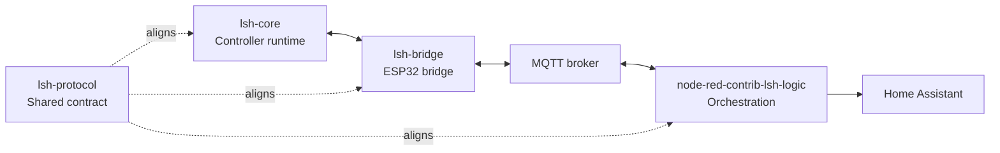

# Getting Started With LSH

This guide is the shortest practical path from "I want to evaluate LSH" to
"I understand how to bring up the public stack without guessing".

It does not replace the repository READMEs. It tells you which ones to open,
in which order, and which settings must line up for the first end-to-end lab
bring-up to work.

If you want the short evaluation answers first, read [FAQ.md](./FAQ.md). If the
bring-up behaves strangely halfway through, use
[TROUBLESHOOTING.md](./TROUBLESHOOTING.md).

## Choose Your Path

- **I only want to understand the architecture**:
  Read [README.md](./README.md), [REFERENCE_STACK.md](./REFERENCE_STACK.md) and
  [GLOSSARY.md](./GLOSSARY.md).
- **I want to understand the real hardware pattern**:
  Add [HARDWARE_OVERVIEW.md](./HARDWARE_OVERVIEW.md).
- **I want the shortest adoption answers before I build anything**:
  Read [FAQ.md](./FAQ.md).
- **I want the first real lab bring-up**:
  Follow the full-stack path below.
- **I already started and something looks inconsistent**:
  Jump to [TROUBLESHOOTING.md](./TROUBLESHOOTING.md).
- **I only care about one layer**:
  Jump directly to the matching repository README after skimming the glossary.

## The Public Stack At A Glance



## Example Assets You Can Reuse

These are the fastest concrete starting points already present in the public
repositories:

- **Controller example**:
  [`lsh-core/examples/multi-device-project`](https://github.com/labodj/lsh-core/tree/main/examples/multi-device-project)
- **Bridge example**:
  [`lsh-bridge/examples/basic-homie-bridge`](https://github.com/labodj/lsh-bridge/tree/main/examples/basic-homie-bridge)
- **Node-RED example flow**:
  [`node-red-contrib-lsh-logic/examples/lsh-logic-example.json`](https://github.com/labodj/node-red-contrib-lsh-logic/blob/main/examples/lsh-logic-example.json)
- **Minimal Node-RED system config**:
  [`node-red-contrib-lsh-logic/examples/system-config.minimal.json`](https://github.com/labodj/node-red-contrib-lsh-logic/blob/main/examples/system-config.minimal.json)
- **Richer multi-device Node-RED config**:
  [`node-red-contrib-lsh-logic/examples/system-config.multi-device.json`](https://github.com/labodj/node-red-contrib-lsh-logic/blob/main/examples/system-config.multi-device.json)

## What You Need For A First Full-Stack Lab

For the public reference path you need:

- one controller target supported by `lsh-core`
- one ESP32 target for `lsh-bridge`
- one MQTT broker
- one Node-RED instance
- optional Home Assistant if you want discovery and entity projection

For the reference electrical pattern used by the current examples:

- a Controllino Maxi on the controller side
- an ESP32 on the bridge side
- a UART path between them
- a 3.3 V / 5 V level shifter when the controller side is 5 V logic

For the exact panel pattern, read [HARDWARE_OVERVIEW.md](./HARDWARE_OVERVIEW.md).

For the controller firmware, start from `lsh-core` `v3.0.0` or newer. The
documented configuration path is TOML-based: device topology lives in
`lsh_devices.toml`, and PlatformIO runs a pre-build generator before compiling.

## Non-Negotiables For The First Bring-Up

Most failed first bring-ups come from one of these mismatches:

### 1. Serial codec must match

- If `lsh-core` uses `CONFIG_MSG_PACK`, `lsh-bridge` must use
  `CONFIG_MSG_PACK_ARDUINO`.
- If the bridge also uses `CONFIG_MSG_PACK_MQTT`, the Node-RED node must be set
  to `MsgPack`, and the upstream `mqtt-in` node must emit a `Buffer`.

### 2. Serial baud must match

- `lsh-core`: `CONFIG_COM_SERIAL_BAUD`
- `lsh-bridge`: `CONFIG_ARDCOM_SERIAL_BAUD`

### 3. Topic layout must match

These values must align between bridge and Node-RED:

- `CONFIG_MQTT_TOPIC_BASE` ↔ `lshBasePath`
- `CONFIG_MQTT_TOPIC_SERVICE` ↔ `serviceTopic`
- Homie base path ↔ `homieBasePath`

The reference examples use:

- LSH base: `LSH/`
- service topic: `LSH/Node-RED/SRV`
- Homie base: `homie/`

### 4. Bridge capacities must fit the controller

The bridge rejects controller topology that exceeds its compiled limits:

- `CONFIG_MAX_ACTUATORS`
- `CONFIG_MAX_BUTTONS`
- `CONFIG_MAX_NAME_LENGTH`

These must be large enough for the `DEVICE_DETAILS` emitted by the controller.

### 5. Node-RED config must match the actual device topology

In `system-config.json`, these must match what the controller really exposes:

- device names
- button IDs
- target device names
- target actuator IDs when `allActuators` is `false`

## First Real Lab Path

### Step 1. Read the core docs first

1. [README.md](./README.md)
2. [REFERENCE_STACK.md](./REFERENCE_STACK.md)
3. [GLOSSARY.md](./GLOSSARY.md)

That should take only a few minutes and removes most ambiguity.

If you are still deciding whether to adopt the stack at all, add
[FAQ.md](./FAQ.md) before moving on.

### Step 2. Start from the controller example

Open:

- [`lsh-core/examples/multi-device-project/platformio.ini`](https://github.com/labodj/lsh-core/blob/main/examples/multi-device-project/platformio.ini)
- [`lsh-core/examples/multi-device-project/lsh_devices.toml`](https://github.com/labodj/lsh-core/blob/main/examples/multi-device-project/lsh_devices.toml)
- [`lsh-core/examples/multi-device-project/README.md`](https://github.com/labodj/lsh-core/blob/main/examples/multi-device-project/README.md)

Use it as the baseline for your controller bring-up.

Important example profiles:

- `J1_release`: lean profile, MsgPack enabled, no network-click subsystem
- `J2_release`: richer profile with network-click behavior enabled

If you want the simplest first controller test, start from the leaner profile
and only add distributed click logic after the base controller/bridge link is
healthy.

The first useful controller-only command is:

```bash
platformio run -d examples/multi-device-project -e J1_release
```

When adapting the example, edit `lsh_devices.toml` first. Keep the generated
headers and `platformio.ini` layout close to the public example until the first
device builds, publishes details, and reports actuator state.

### Step 3. Start from the bridge example

Open:

- [`lsh-bridge/examples/basic-homie-bridge/platformio.ini`](https://github.com/labodj/lsh-bridge/blob/main/examples/basic-homie-bridge/platformio.ini)

This example already reflects the public topic profile:

- `LSH/<device>/conf`
- `LSH/<device>/state`
- `LSH/<device>/events`
- `LSH/<device>/bridge`
- `LSH/<device>/IN`
- `LSH/Node-RED/SRV`

For the first pass, avoid changing topic names, service topic or codec choices
unless you have a strong reason.

### Step 4. Bring up MQTT and Node-RED

Install the Node-RED package as documented in:

- [`node-red-contrib-lsh-logic` README](https://github.com/labodj/node-red-contrib-lsh-logic)

Then import:

- [`examples/lsh-logic-example.json`](https://github.com/labodj/node-red-contrib-lsh-logic/blob/main/examples/lsh-logic-example.json)

And place one of these under your Node-RED user directory:

- [`examples/system-config.minimal.json`](https://github.com/labodj/node-red-contrib-lsh-logic/blob/main/examples/system-config.minimal.json)
- [`examples/system-config.multi-device.json`](https://github.com/labodj/node-red-contrib-lsh-logic/blob/main/examples/system-config.multi-device.json)

The example flow already shows the intended shape:

- dynamic `mqtt-in` subscription management
- `lsh-logic` as central orchestrator
- MQTT-out for LSH commands
- debug outputs for commands, alerts, topics and raw traffic

### Step 5. Verify the first healthy signs

When the stack is lined up, the first useful things to look for are:

- a valid `conf` publish for the controller device
- a valid `state` publish for the same device
- bridge-local traffic on `LSH/<device>/bridge`
- controller-backed traffic on `LSH/<device>/events`
- Node-RED topic subscription updates emitted from the Configuration output

If one of those signals is missing, stop guessing and use
[TROUBLESHOOTING.md](./TROUBLESHOOTING.md).

### Step 6. Only then add richer behavior

Once the base stack is healthy, expand in this order:

1. more controller devices
2. network click logic
3. Home Assistant discovery overrides
4. MsgPack over MQTT
5. custom topic naming or deployment-specific tuning

## Best First Questions To Ask Yourself

Before you customize anything, decide:

- Do you want the public reference topic layout unchanged?
- Do you want JSON first for observability, or MsgPack first for compactness?
- Do you need only local controller logic, or distributed click orchestration too?
- Are you evaluating the stack, or already shaping a deployment?
- Are you changing one variable at a time, or changing hardware, topics, codecs
  and device names in the same pass?

Those answers tell you how much of the stack to adopt immediately.

## Read Next

- For the hardware pattern: [HARDWARE_OVERVIEW.md](./HARDWARE_OVERVIEW.md)
- For the shared terminology: [GLOSSARY.md](./GLOSSARY.md)
- For the stack profile: [REFERENCE_STACK.md](./REFERENCE_STACK.md)
- For short adoption answers: [FAQ.md](./FAQ.md)
- For symptom-based diagnosis: [TROUBLESHOOTING.md](./TROUBLESHOOTING.md)
