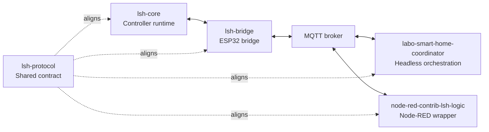

# Getting Started With LSH

This guide gives you a practical path from "I want to evaluate LSH" to "I know how to
bring up the reference stack without guessing".

It keeps the first run intentionally narrow. Start from the public examples, make one
controller-to-bridge-to-orchestrator path healthy, then customize one layer at a time.
For the broader documentation map, use [DOCS.md](./DOCS.md).

## Before You Start

- If the runtime model is still unclear, read
  [REFERENCE_STACK.md](./REFERENCE_STACK.md).
- If you are already debugging symptoms, use [TROUBLESHOOTING.md](./TROUBLESHOOTING.md).
- If you are still deciding whether LSH fits your project, skim [FAQ.md](./FAQ.md).

## The Public Stack at a Glance



## Pick One Setup Path

For a first full-stack installation, prefer the configurator path. You describe the
controller once in `core/lsh_devices.toml`, describe the installation in
`lsh_stack.toml`, then let `lsh-stack generate` write the PlatformIO fragments,
coordinator config, Node-RED values and deployment commands. This path is easier to
check because the repeated names, topics and build flags come from one place.

Use the manual path when you are adopting only one piece of LSH, or when an existing
project already has hand-maintained PlatformIO and orchestration files. The same rules
still apply, but you copy the values yourself: controller topology in `lsh-core`, bridge
build flags and MQTT/Homie settings in `lsh-bridge`, and matching device names in the
coordinator or Node-RED node.

Generated files are not a second source of truth. Regenerate them whenever the TOML
changes, and keep hand-written notes or overrides outside `generated/`.

## Who Does What

| Piece                        | What you edit first                 | Why it exists                                            |
| ---------------------------- | ----------------------------------- | -------------------------------------------------------- |
| `lsh-core`                   | `core/lsh_devices.toml`             | Keeps wired inputs, outputs and local behavior working.  |
| `lsh-bridge`                 | generated or manual build flags     | Publishes controller state and accepts commands on MQTT. |
| MQTT broker                  | broker host, auth and topic choices | Carries LSH and Homie messages between every runtime.    |
| coordinator or Node-RED node | generated `systemConfig` values     | Adds behavior that needs more than one controller.       |
| `lsh-protocol`               | normally nothing in an installation | Keeps compact keys and payload shapes aligned.           |
| `homie-esp8266` OTA helper   | generated `bridge-ota.json` or CLI  | Sends bridge firmware OTA over MQTT/Homie.               |

Start by making one row healthy at a time. Do not rename topics, switch codecs and add
distributed click logic in the same pass.

## What You Need for a First Full-Stack Lab

For the public reference path you need:

- one controller target supported by `lsh-core`
- one ESP32 target for `lsh-bridge`
- one MQTT broker
- one orchestration runtime:
  [`labo-smart-home-coordinator`](https://github.com/labodj/labo-smart-home-coordinator)
  for CLI/library deployments, or
  [`node-red-contrib-lsh-logic`](https://github.com/labodj/node-red-contrib-lsh-logic)
  when you want Node-RED

For the reference electrical pattern used by the current examples:

- a Controllino Maxi on the controller side
- an ESP32 on the bridge side
- a UART path between them
- a 3.3 V / 5 V level shifter when the controller side is 5 V logic

For the exact panel pattern, read [HARDWARE_OVERVIEW.md](./HARDWARE_OVERVIEW.md).

For the controller firmware, start from `lsh-core` v3.0.0 or newer. In the normal user
path, your personal project consumes `lsh-core` and `lsh-bridge` as PlatformIO
libraries. Device topology lives in `lsh_devices.toml`, and PlatformIO runs the
controller pre-build generator before compiling.

For finished bridge firmware fragments, coordinator configuration and Node-RED node
settings, add `lsh_stack.toml` after the controller profile is valid. The stack composer
reads the controller contract and generates deployment artifacts without mixing MQTT or
Node-RED settings into the firmware TOML.

If you also want entities in Home Assistant, add an external generic Homie discovery
tool after the LSH path is healthy:
[`homie-home-assistant-discovery`](https://github.com/labodj/homie-home-assistant-discovery)
or
[`node-red-contrib-homie-home-assistant-discovery`](https://github.com/labodj/node-red-contrib-homie-home-assistant-discovery).

## First Bring-Up Checks

Most first bring-up problems come from one of these mismatches:

### 1. Serial codec must match

- If `lsh-core` uses `CONFIG_MSG_PACK`, `lsh-bridge` must use `CONFIG_MSG_PACK_ARDUINO`.
- If the bridge also uses `CONFIG_MSG_PACK_MQTT`, the Node-RED node must be set to
  `MsgPack`, and the upstream `mqtt-in` node must emit a `Buffer`.

### 2. Serial baud must match

- `lsh-core`: `CONFIG_COM_SERIAL_BAUD`
- `lsh-bridge`: `CONFIG_ARDCOM_SERIAL_BAUD`

### 3. Topic layout must match

These values must align between the bridge and the coordinator runtime, whether it runs
directly or through Node-RED:

- `CONFIG_MQTT_TOPIC_BASE` ↔ `lshBasePath`
- `CONFIG_MQTT_TOPIC_SERVICE` ↔ `serviceTopic`
- Homie base path ↔ `homieBasePath`

The reference examples use:

- LSH base: `LSH/`
- service topic: `LSH/Node-RED/SRV`
- Homie base: `homie/`

### 4. Bridge capacities must fit the controller

The bridge rejects controller topology that exceeds its compiled limits:

- `CONFIG_MAX_ACTUATORS`
- `CONFIG_MAX_BUTTONS`
- `CONFIG_MAX_NAME_LENGTH`

These limits must be large enough for the `DEVICE_DETAILS` emitted by the controller.

### 5. Orchestrator config must match the actual device topology

In the coordinator config, these must match what the controller really exposes:

- device names
- button IDs
- target device names
- target actuator IDs when `allActuators` is `false`

## First Lab Path

### Step 1. Align on the reference profile

Read [REFERENCE_STACK.md](./REFERENCE_STACK.md) before wiring pieces together. It
defines the topic layout, bootstrap behavior, and role boundaries used by the public
examples.

If a term feels overloaded, skim [GLOSSARY.md](./GLOSSARY.md). If you are still deciding
whether to adopt the stack at all, read [FAQ.md](./FAQ.md) before moving on.

### Step 2. Create one personal project

Create a starter project first:

If `lsh-stack` is already installed:

```bash
lsh-stack new my-lsh-installation
cd my-lsh-installation
```

From a checkout of `labo-smart-home`, use the standard Python launcher script. On
Windows, use `py` instead of `python` if that is how Python is installed:

```bash
python /path/to/labo-smart-home/lsh-stack.py new my-lsh-installation
cd my-lsh-installation
```

The files to edit are `core/lsh_devices.toml`, `lsh_stack.toml` and, for local
PlatformIO base settings, `core/platformio.ini` or `bridge/platformio.ini`. The
`generated/` directory is disposable. Keep persistent manual notes or expert extensions
in `overrides/`.

The starter project includes bootstrap `generated/platformio-core.ini` and
`generated/platformio-bridge.ini` files. They exist so PlatformIO can see the first
environments and install packages before the real generator has run.

Run the guided setup first:

```bash
lsh-stack setup
```

When using the single-file `lsh-stack.pyz` launcher from a GitHub Release, run the same
command through Python:

```bash
python /path/to/lsh-stack.pyz setup
```

When working from a checkout and `lsh-stack` is not installed, use:

```bash
python /path/to/labo-smart-home/lsh-stack.py setup
```

If you only want a standalone `lsh-core` firmware project, start smaller:

```bash
lsh-stack new-core my-lsh-core
cd my-lsh-core
platformio run -e core_panel
```

`setup` generates the first output set, checks the stack, and, when the PlatformIO CLI
is available, builds the starter controller once if that is needed to install
`lsh-core`. If you are recreating an installation from existing TOML files, `setup` also
creates missing core/bridge PlatformIO project shells without overwriting existing
project files.

If PlatformIO is only available inside VSCode, open `core/` with the PlatformIO
extension and run `core_panel` -> Build once, then rerun `lsh-stack setup`.

The expert commands remain available when you intentionally want each step separated:

```bash
lsh-stack generate
lsh-stack check
```

From a checkout:

```bash
python /path/to/labo-smart-home/lsh-stack.py generate
python /path/to/labo-smart-home/lsh-stack.py check
```

After generation, continue from VSCode PlatformIO Project Tasks or from the PlatformIO
CLI. Both paths use the same `core/` and `bridge/` projects and the same generated
environments.

When `[deploy.bridge.ota]` is configured, bridge OTA can also be driven directly from
the stack CLI:

```bash
lsh-stack ota panel
lsh-stack ota panel lights
lsh-stack ota
```

The last command builds the default bridge profile and updates every configured bridge.
If a prerequisite is missing, the command exits with the install command to run.

The generated files give you bridge PlatformIO flags, controller and bridge
environments, coordinator `systemConfig`, Node-RED `lsh-logic` settings and exact
build/upload commands derived from the same controller profile.

If generation fails, run:

```bash
python /path/to/labo-smart-home/lsh-stack.py doctor
```

To inspect one controller before flashing it:

```bash
python /path/to/labo-smart-home/lsh-stack.py explain panel
```

### Step 3. Compare with the controller example

Open:

- [`lsh-core/examples/multi-device-project/platformio.ini`](https://github.com/labodj/lsh-core/blob/main/examples/multi-device-project/platformio.ini)
- [`lsh-core/examples/multi-device-project/lsh_devices.toml`](https://github.com/labodj/lsh-core/blob/main/examples/multi-device-project/lsh_devices.toml)
- [`lsh-core/examples/multi-device-project/README.md`](https://github.com/labodj/lsh-core/blob/main/examples/multi-device-project/README.md)

Use that example as the baseline when you want more devices, more relays or
network-click behavior than the starter project includes.

Important example profiles:

- `J1_release`: lean profile with MsgPack enabled and network-click behavior disabled
- `J2_release`: richer profile with network-click behavior enabled

If you want the simplest first controller test, start from the leaner profile and only
add distributed click logic after the base controller/bridge link is healthy.

A useful controller-only build command for automation is:

```bash
platformio run -d examples/multi-device-project -e J1_release
```

When adapting the example, edit `lsh_devices.toml` first. Keep generated headers and
machine output inside `generated/` until the first device builds, publishes details and
reports actuator state.

### Step 4. Compare with the bridge example

Open:

- [`lsh-bridge/examples/basic-homie-bridge/platformio.ini`](https://github.com/labodj/lsh-bridge/blob/main/examples/basic-homie-bridge/platformio.ini)

This example already reflects the public topic profile:

- `LSH/<device>/conf`
- `LSH/<device>/state`
- `LSH/<device>/events`
- `LSH/<device>/bridge`
- `LSH/<device>/IN`
- `LSH/Node-RED/SRV`

For the first pass, keep topic names, service topic, and codec choices unchanged unless
your hardware or deployment requires a change.

### Step 5. Bring up MQTT and orchestration

Pick the orchestration surface that matches how you want to operate the stack.

Use the standalone package when you want a headless service, CLI process, or custom
Node.js integration:

- [`labo-smart-home-coordinator` README](https://github.com/labodj/labo-smart-home-coordinator)

Use the Node-RED wrapper when you want a visual flow, debug sidebar, and
Node-RED-managed MQTT nodes:

- [`node-red-contrib-lsh-logic` README](https://github.com/labodj/node-red-contrib-lsh-logic)
- [`examples/lsh-logic-example.json`](https://github.com/labodj/node-red-contrib-lsh-logic/blob/main/examples/lsh-logic-example.json)

For a stack generated with `lsh-stack`, open `generated/node-red-setup.md` and follow
the GUI checklist. It tells you exactly what to paste into the `lsh-logic` node and
which settings to select, while the surrounding MQTT nodes remain normal Node-RED
configuration.

For manual experiments, Node-RED `v3.0.0+` can still paste system config JSON directly
into the node editor. The reusable examples are:

- [`examples/inline-config.minimal.json`](https://github.com/labodj/node-red-contrib-lsh-logic/blob/main/examples/inline-config.minimal.json)
- [`examples/inline-config.multi-device.json`](https://github.com/labodj/node-red-contrib-lsh-logic/blob/main/examples/inline-config.multi-device.json)

The example flow already shows the intended shape:

- dynamic `mqtt-in` subscription management
- `lsh-logic` as central orchestrator
- MQTT-out for LSH commands
- debug outputs for commands, alerts, topics, and raw traffic

### Step 6. Verify the first healthy signs

When the stack is lined up, the first useful things to look for are:

- a valid `conf` publish for the controller device
- a valid `state` publish for the same device
- bridge-local traffic on `LSH/<device>/bridge`
- controller-backed traffic on `LSH/<device>/events`
- topic subscription updates emitted by the coordinator, or by the Node-RED wrapper's
  Configuration output

If one of those signals is missing, use [TROUBLESHOOTING.md](./TROUBLESHOOTING.md)
before changing more variables.

### Step 7. Add richer behavior after the base path works

Once the base stack is healthy, expand in this order:

1. more controller devices
2. network click logic
3. optional external Homie-to-Home-Assistant discovery, after the LSH path is stable
4. MsgPack over MQTT
5. custom topic naming or deployment-specific tuning

## Questions to Ask Before Customizing

Before you customize anything, decide:

- Do you want the public reference topic layout unchanged?
- Do you want JSON first for observability, or MsgPack first for compactness?
- Do you need only local controller logic, or distributed click orchestration too?
- Are you evaluating the stack, or already shaping a deployment?
- Are you changing one variable at a time, or changing hardware, topics, codecs, and
  device names in the same pass?

Those answers tell you how much of the stack to adopt immediately.

For repository links, protocol details, and alternate reading paths, use
[DOCS.md](./DOCS.md).
