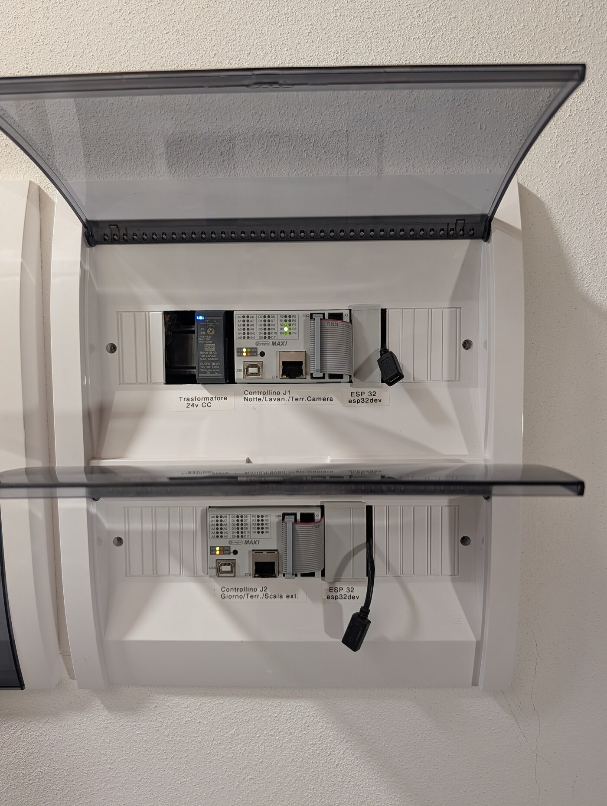

# Labo Smart Home

Labo Smart Home (`LSH`) is a wired, local-first home automation stack for installations
where wall buttons, relays, and indicator LEDs need to remain responsive, predictable,
and under local control.

The project grew out of a home installation that began during a renovation and kept
evolving afterward. The core design goal has not changed: keep the wired controls
dependable, then expose their state and commands cleanly through MQTT/Homie and the
orchestration layer instead of hiding the system inside a single opaque box.

The current reference installation uses **six Controllino Maxi PLCs**, each paired with
an **ESP32 Wi-Fi bridge**. The PLCs handle physical I/O and local behavior. The bridges
publish controller state over **MQTT** using the **Homie** device model. The
orchestration layer can run in **Node-RED** or as a headless **Node.js coordinator**.

This repository is the public entry point for LSH. It shows how the pieces fit together,
where each component lives, and which docs to read next.

## What LSH Is

LSH is a reference stack for wired home automation. A Controllino controller keeps local
inputs and outputs usable without the network. An ESP32 bridge publishes state and
accepts commands over MQTT/Homie. A coordinator adds behavior that needs system-wide
context, while a shared protocol package keeps compact payloads aligned across the
components.

The public repositories are installable packages rather than only source snapshots: the
controller and bridge libraries are available through PlatformIO, and the orchestration
layer can be used either from Node-RED or as a standalone Node.js runtime.

LSH is not a packaged plug-and-play smart-home product or the simplest path for a few
Wi-Fi bulbs. It fits projects whose maintainers are comfortable with electrical
planning, firmware builds, MQTT services, and gradual integration.

## When LSH Fits

- Your wired controls need to keep working when Wi-Fi or the MQTT broker is unavailable.
- You prefer small components with clear boundaries over a single all-in-one automation
  box.
- You want command IDs, compact keys, and payload shapes defined in one place.
- You already use, or can reasonably adopt, tools such as PlatformIO, MQTT, Homie,
  Node.js, or Node-RED.
- You are looking for a reference implementation shaped by real panels, timing
  constraints, and maintenance work.

## Current Installation

The photo below shows the current panel layout: a Controllino Maxi paired with an
internal ESP32 bridge, a dedicated controller-to-bridge link, and external USB service
leads kept available for firmware maintenance.

<p>
  
</p>

The early photos show how the project started: cable runs, controller bring-up and panel
work during the house renovation.

<table>
  <tr>
    <td width="50%">
      
    </td>
    <td width="50%">
      
    </td>
  </tr>
  <tr>
    <td>Early wiring while bringing multiple cable runs into the system.</td>
    <td>One of the first Controllino-based installations during integration.</td>
  </tr>
</table>

For details on power, UART, level shifting, and panel serviceability, read
[HARDWARE_OVERVIEW.md](./HARDWARE_OVERVIEW.md).

## Public Repositories

| Repository                                                                             | Role                                                          | Latest public release                                                                                                                                                                                                                                                                                                                         |
| -------------------------------------------------------------------------------------- | ------------------------------------------------------------- | --------------------------------------------------------------------------------------------------------------------------------------------------------------------------------------------------------------------------------------------------------------------------------------------------------------------------------------------- |
| [`lsh-core`](https://github.com/labodj/lsh-core)                                       | Arduino/Controllino runtime for wired controller-side logic   | [](https://github.com/labodj/lsh-core/releases/latest) [](https://registry.platformio.org/libraries/labodj/lsh-core)                |
| [`lsh-bridge`](https://github.com/labodj/lsh-bridge)                                   | ESP32 bridge for serial LSH protocol and MQTT/Homie exposure  | [](https://github.com/labodj/lsh-bridge/releases/latest) [](https://registry.platformio.org/libraries/labodj/lsh-bridge)        |
| [`labo-smart-home-coordinator`](https://github.com/labodj/labo-smart-home-coordinator) | Standalone orchestration runtime for CLI and Node.js services | [](https://github.com/labodj/labo-smart-home-coordinator/releases/latest) [](https://www.npmjs.com/package/labo-smart-home-coordinator)         |
| [`node-red-contrib-lsh-logic`](https://github.com/labodj/node-red-contrib-lsh-logic)   | Node-RED wrapper around the coordinator runtime               | [](https://github.com/labodj/node-red-contrib-lsh-logic/releases/latest) [](https://flows.nodered.org/node/node-red-contrib-lsh-logic) |
| [`lsh-protocol`](https://github.com/labodj/lsh-protocol)                               | Shared protocol spec, generators, and golden payloads         | [](https://github.com/labodj/lsh-protocol/releases/latest)                                                                                                                                                                         |

Optional Home Assistant discovery is handled outside LSH by generic Homie discovery
projects, not by the LSH coordinator:

| Repository                                                                                                                     | Role                                         | Latest public release                                                                                                                                                                                                                                                                                                                                                                                        |
| ------------------------------------------------------------------------------------------------------------------------------ | -------------------------------------------- | ------------------------------------------------------------------------------------------------------------------------------------------------------------------------------------------------------------------------------------------------------------------------------------------------------------------------------------------------------------------------------------------------------------ |
| [`homie-home-assistant-discovery`](https://github.com/labodj/homie-home-assistant-discovery)                                   | Standalone daemon or embeddable Node.js core | [](https://github.com/labodj/homie-home-assistant-discovery/releases/latest) [](https://www.npmjs.com/package/homie-home-assistant-discovery)                                                            |
| [`node-red-contrib-homie-home-assistant-discovery`](https://github.com/labodj/node-red-contrib-homie-home-assistant-discovery) | Node-RED wrapper for Homie discovery         | [](https://github.com/labodj/node-red-contrib-homie-home-assistant-discovery/releases/latest) [](https://flows.nodered.org/node/node-red-contrib-homie-home-assistant-discovery) |

Maintained infrastructure forks are available when needed, but they are supporting code
rather than starting points. The
[`homie-esp8266`](https://github.com/labodj/homie-esp8266) fork is published as
[`labodj/homie-v5`](https://registry.platformio.org/libraries/labodj/homie-v5) for
ESP8266/ESP32 Arduino projects that need Homie 3.0.1 compatibility plus opt-in Homie
v4/v5 discovery modes. The MQTT client fork lives at
[`async-mqtt-client`](https://github.com/labodj/async-mqtt-client).

## Runtime Shape

```text
+------------------+     +------------------+     +-------------+     +-----------------------------+
| lsh-core         |<--->| lsh-bridge       |<--->| MQTT broker |<--->| coordinator / Node-RED node |
| Controllino side |     | ESP32 bridge     |     | transport   |     | orchestration               |
+------------------+     +------------------+     +-------------+     +-----------------------------+
```

Practical boundary summary:

- `lsh-core` implements wired I/O, device topology, local click handling and compact
  payload encoding.
- `lsh-bridge` handles the serial handshake, MQTT transport, Homie exposure, cached
  snapshot replay and bridge-side synchronization.
- `labo-smart-home-coordinator` maintains registry state, watchdog logic, startup
  recovery, and distributed click orchestration.
- `node-red-contrib-lsh-logic` runs the coordinator inside Node-RED.
- `lsh-protocol` keeps command IDs, compact keys, compatibility metadata, and generated
  artifacts in sync across the components.

Home Assistant is not part of the LSH runtime path. If you want Home Assistant MQTT
discovery, attach a generic Homie discovery daemon or Node-RED discovery node to the
Homie topics published by `lsh-bridge`.

For the exact MQTT topics, bootstrap rules, `PING`, `BOOT`, and network-click semantics,
read [REFERENCE_STACK.md](./REFERENCE_STACK.md).

## Start Reading

- Use [DOCS.md](./DOCS.md) as the public documentation map.
- Follow [GETTING_STARTED.md](./GETTING_STARTED.md) for a first end-to-end lab setup.
- Keep [TROUBLESHOOTING.md](./TROUBLESHOOTING.md) nearby once real MQTT traffic and
  hardware are involved.

If you are evaluating LSH for adoption, keep the public examples close to the stock
configuration for the first successful run. Avoid changing topics, codecs, device names,
and hardware assumptions all at once. Get a clean controller-to-bridge-to-coordinator
chain working first, then customize one layer at a time.

## Technical Direction

A few design choices have stayed consistent through the years:

- wired controllers first, network second
- local logic must keep working when Wi-Fi or the broker misbehaves
- shared protocol contracts avoid copy-pasted constants
- resource usage matters on both AVR and ESP32 targets
- topology is treated as static between controller boots

Since `lsh-core` v3.0.0, controller topology is configured from TOML and compiled into
optimized static profiles. New adopters typically edit `lsh_devices.toml`; a device
profile no longer needs hand-written C++ topology code or hand-maintained actuator ID
lookup tables.

## Public History

LSH did not begin as a clean public multi-repo design. Early versions were much more
monolithic, and a lot of automation logic lived in large Node-RED flows. Over time, the
project was split into reusable pieces: controller runtime, ESP32 bridge runtime,
protocol source of truth, standalone coordinator and a thin Node-RED wrapper.

The repositories were published after years of real-world use, refactoring and cleanup.
This landing repository is not a separately versioned software artifact; component
release history lives in the repositories listed above.
