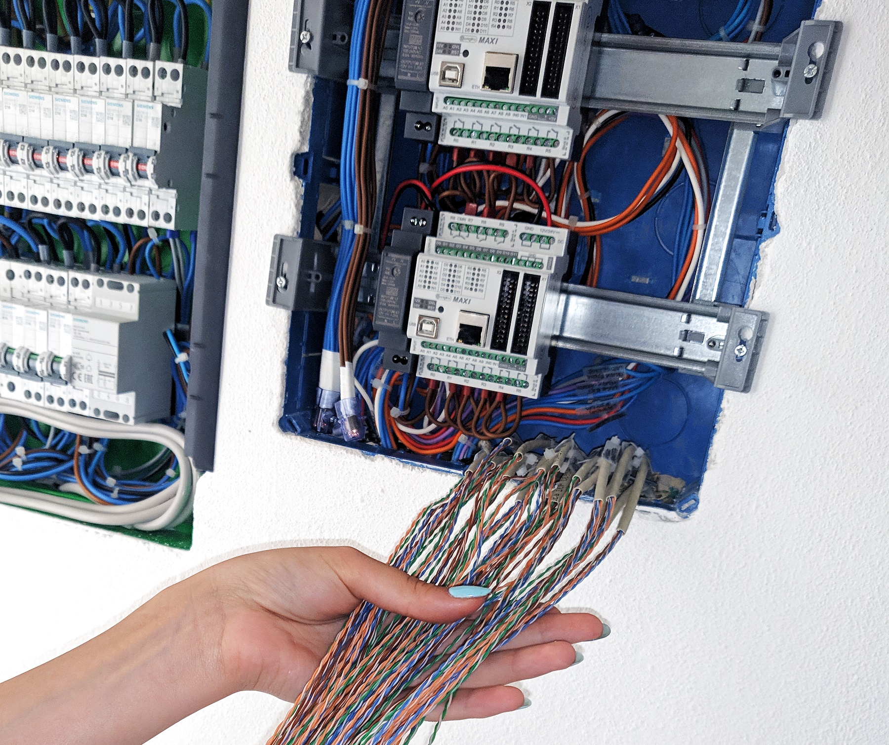
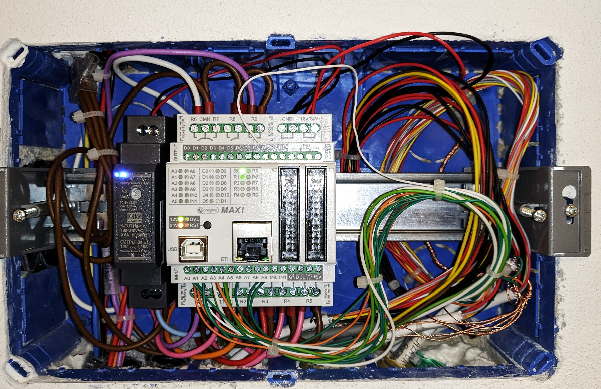
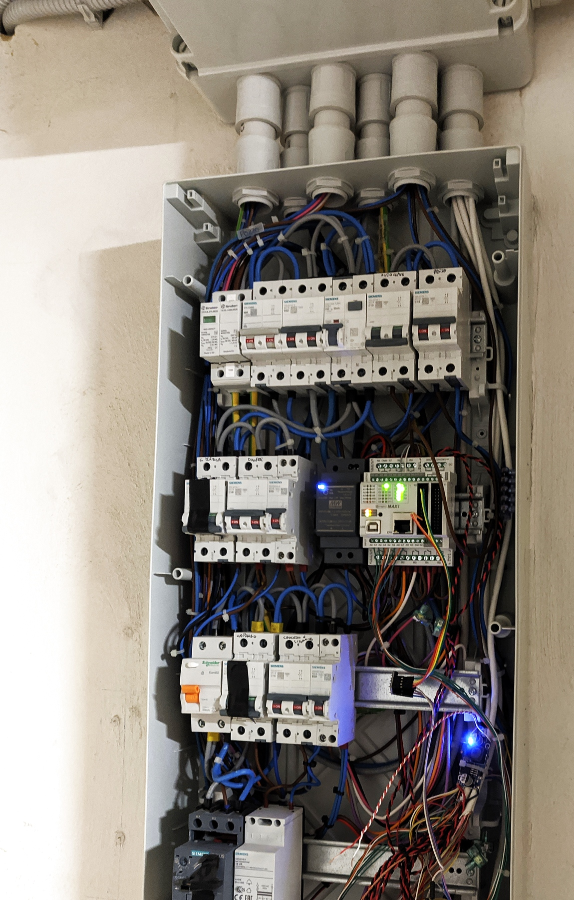

# Labo Smart Home

Labo Smart Home, or `LSH`, is my long-running personal home automation stack.

It started during a house renovation seven years before this public release. I wanted a wired, deterministic, low-latency system for buttons, relays and indicator LEDs, without depending on opaque cloud services or generic all-in-one hubs.

The current private installation is built around **six Controllino Maxi PLCs** connected to **ESP32 Wi-Fi bridges**. The controllers handle the physical I/O and local logic, the bridges expose the runtime over **MQTT** with a **Homie** device model, and a central **Node-RED** component orchestrates discovery, health monitoring and distributed automation logic.

This repository is the public entry point for the LSH ecosystem. Its goal is simple: explain the overall architecture, link the public repositories, and make the project understandable without forcing visitors to reconstruct the whole system from four separate codebases.

## Public Scope

The public side of LSH is intentionally split into reusable building blocks.

| Repository                                                                           | Role                                                        | Latest public release                                                                |
| ------------------------------------------------------------------------------------ | ----------------------------------------------------------- | ------------------------------------------------------------------------------------ |
| [`lsh-core`](https://github.com/labodj/lsh-core)                                     | Arduino / Controllino runtime for the wired controller side | [`v1.1.0`](https://github.com/labodj/lsh-core/releases/tag/v1.1.0)                   |
| [`lsh-bridge`](https://github.com/labodj/lsh-bridge)                                 | ESP32 bridge runtime between serial LSH, MQTT and Homie     | [`v1.0.1`](https://github.com/labodj/lsh-bridge/releases/tag/v1.0.1)                 |
| [`node-red-contrib-lsh-logic`](https://github.com/labodj/node-red-contrib-lsh-logic) | Central orchestration node for Node-RED                     | [`v1.5.0`](https://github.com/labodj/node-red-contrib-lsh-logic/releases/tag/v1.5.0) |
| [`lsh-protocol`](https://github.com/labodj/lsh-protocol)                             | Shared wire protocol spec, generators and golden payloads   | [`v1.0.0`](https://github.com/labodj/lsh-protocol/releases/tag/v1.0.0)               |

Maintained infrastructure forks exist as support repositories, but they are not the main public entry point of the project:

- [`homie-esp8266`](https://github.com/labodj/homie-esp8266)
- [`async-mqtt-client`](https://github.com/labodj/async-mqtt-client)

## Early Build

These WIP photos are from 2019, during the original house renovation and early electrical panel work. They are not polished beauty shots, but they make the project history much more concrete than a clean architecture diagram alone.

<table>
  <tr>
    <td width="50%"></td>
    <td width="50%"></td>
  </tr>
  <tr>
    <td>Early wiring stage while bringing multiple cable runs into the automation stack.</td>
    <td>One of the early Controllino-based installs during integration and bring-up.</td>
  </tr>
</table>

<p>
  
</p>

Panel progress during one of the early integration phases.

## Runtime Architecture

```text
+------------------+     +------------------+     +-------------+     +---------------------------+     +----------------+
| lsh-core         |<--->| lsh-bridge       |<--->| MQTT broker |<--->| node-red-contrib-lsh-logic|---->| Home Assistant |
| Controllino side |     | ESP32 bridge     |     | transport   |     | orchestration             |     | UI / entities  |
+------------------+     +------------------+     +-------------+     +---------------------------+     +----------------+
```

| Repository                   | Runtime responsibility                                                       |
| ---------------------------- | ---------------------------------------------------------------------------- |
| `lsh-core`                   | Wired controller runtime: physical I/O, local logic, compact payloads        |
| `lsh-bridge`                 | ESP32 bridge runtime: serial handshake, MQTT transport, Homie model          |
| `node-red-contrib-lsh-logic` | Central orchestration: registry, watchdog, discovery, distributed logic      |
| `lsh-protocol`               | Shared wire contract: command IDs, compact keys, generators, golden payloads |

Practical boundary summary:

- `lsh-core` owns wired I/O, device topology, local click handling and compact payload encoding.
- `lsh-bridge` owns the serial handshake, MQTT transport, Homie exposure and bridge-side state synchronization.
- `node-red-contrib-lsh-logic` owns registry state, watchdog logic, discovery and distributed click orchestration.
- `lsh-protocol` keeps command IDs, compact keys, compatibility metadata and generated artifacts aligned across the stack.

## Why The Split Exists

LSH did not begin as a clean public multi-repo design.

The earliest versions were much more monolithic, and a lot of the automation logic lived in large Node-RED flows. Over time, the stack was progressively refactored into clearer boundaries:

- a reusable controller runtime instead of a one-off firmware tree
- a reusable ESP32 bridge runtime instead of a tightly coupled bridge project
- a standalone protocol source of truth instead of implicit duplicated constants
- a tested TypeScript Node-RED node instead of increasingly fragile visual flow logic

That split is intentional. The public repositories are meant to expose the reusable technical core, while deployment-specific composition, hardware mapping and site-specific configuration stay private.

## What Is Still Private

Some parts of the real installation are intentionally not public:

- the private controller composition repository used to build the live device fleet
- the private bridge consumer repository used for branding, OTA and personal deployment workflows
- house-specific configuration, naming, topology and installation details

This is not an attempt to hide the interesting parts. It is a deliberate boundary between reusable code and private deployment state.

## Technical Direction

A few design choices stayed constant through the years:

- wired controllers first, network second
- local logic must keep working even when Wi-Fi or the broker misbehaves
- explicit protocol contracts beat copy-pasted constants
- resource usage matters on both AVR and ESP32 targets
- topology is treated as static between controller boots

## Start Here

If you want to understand the project quickly, this is the shortest path:

1. Read [`lsh-core`](https://github.com/labodj/lsh-core) to understand the controller-side runtime model.
2. Read [`lsh-bridge`](https://github.com/labodj/lsh-bridge) to see how the serial side is exposed over MQTT and Homie.
3. Read [`node-red-contrib-lsh-logic`](https://github.com/labodj/node-red-contrib-lsh-logic) for the orchestration layer.
4. Read [`lsh-protocol`](https://github.com/labodj/lsh-protocol) if you want the exact shared payload contract.

## Public Release Notes

The repositories were opened publicly only after years of private use, refactoring and cleanup. The public release therefore reflects the current reusable architecture, not the original historical monoliths.

This landing repository will be extended over time with more diagrams, photos and implementation notes, but the core code and release history already live in the repositories linked above.
