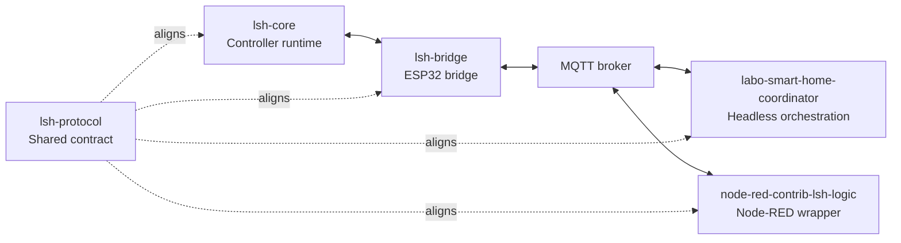
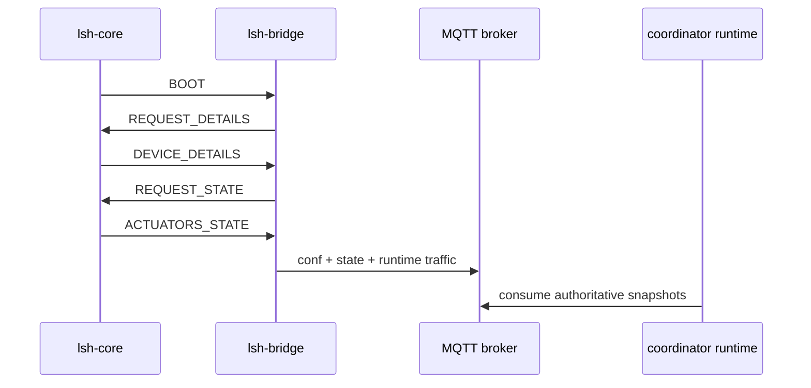
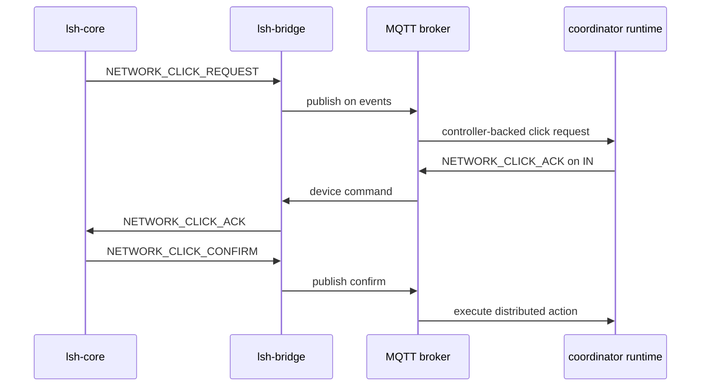

# LSH Reference Stack

This document defines the current **public reference stack** for Labo Smart Home.

The base LSH protocol is intentionally transport-agnostic and role-oriented. The public
stack documented here is the concrete profile implemented by the current repositories
and used by the live installation.

Read this page when you want one coherent cross-repo explanation before diving into
repository-specific details. For the broader reading map, use [DOCS.md](./DOCS.md).

## Public Repositories

| Repository                                                                             | Role in the reference stack                                                              |
| -------------------------------------------------------------------------------------- | ---------------------------------------------------------------------------------------- |
| [`lsh-core`](https://github.com/labodj/lsh-core)                                       | Authoritative controller runtime for field I/O, local logic, and compact serial payloads |
| [`lsh-bridge`](https://github.com/labodj/lsh-bridge)                                   | ESP32 bridge for serial LSH protocol, MQTT/Homie exposure, and diagnostics               |
| [`labo-smart-home-coordinator`](https://github.com/labodj/labo-smart-home-coordinator) | Central orchestration peer on MQTT for headless CLI/library deployments                  |
| [`node-red-contrib-lsh-logic`](https://github.com/labodj/node-red-contrib-lsh-logic)   | Node-RED wrapper around the same orchestration runtime                                   |
| [`lsh-protocol`](https://github.com/labodj/lsh-protocol)                               | Shared source of truth for command IDs, compact keys, and generated artifacts            |

## Optional External Home Assistant Discovery

Home Assistant MQTT discovery is outside this LSH reference stack. If you need it, use a
generic Homie discovery project:
[`homie-home-assistant-discovery`](https://github.com/labodj/homie-home-assistant-discovery)
as a standalone daemon or embeddable Node.js core, or
[`node-red-contrib-homie-home-assistant-discovery`](https://github.com/labodj/node-red-contrib-homie-home-assistant-discovery)
as a Node-RED node.

## Runtime Shape

```text
+------------------+     +------------------+     +-------------+     +-----------------------------+
| lsh-core         |<--->| lsh-bridge       |<--->| MQTT broker |<--->| coordinator / Node-RED node |
| Controllino side |     | ESP32 bridge     |     | transport   |     | orchestration               |
+------------------+     +------------------+     +-------------+     +-----------------------------+
```

The runtime path has three active peers. `lsh-protocol` sits beside them as the shared
contract that keeps payload IDs, keys, and generated code aligned.



## Responsibilities

- `lsh-core` is authoritative for physical inputs, relays, indicators, local click
  behavior, and device topology/state emitted on the serial link.
- `lsh-bridge` handles serial framing, controller synchronization, MQTT transport, Homie
  projection, and bridge-local diagnostics.
- `labo-smart-home-coordinator` maintains central registry state, startup recovery,
  watchdog logic, and distributed click orchestration across devices.
- `node-red-contrib-lsh-logic` embeds that coordinator in Node-RED and exposes a visual
  configuration surface.
- `lsh-protocol` owns the wire-level contract, not the runtime policy of any specific
  implementation.

## MQTT Profile

The current public MQTT profile uses these topic families:

- `LSH/<device>/conf`: authoritative device topology snapshot derived from
  `DEVICE_DETAILS`
- `LSH/<device>/state`: authoritative actuator state snapshot derived from
  `ACTUATORS_STATE`
- `LSH/<device>/events`: controller-backed runtime traffic such as `NETWORK_CLICK_*`
  payloads and device-level `PING` replies
- `LSH/<device>/bridge`: bridge-local runtime traffic such as service-level ping replies
  and diagnostics
- `LSH/<device>/IN`: inbound device command topic consumed by `lsh-bridge`
- `LSH/Node-RED/SRV`: bridge-scoped service topic used for public orchestration and
  recovery commands

That split is intentional: consumers must not treat bridge-local traffic as if it were
proof that the downstream controller is currently alive.

## Bootstrap and Resync

The reference stack uses a strict controller-authoritative resync model:

1. `lsh-core` finishes configuration and emits `BOOT`.
2. `lsh-bridge` treats that `BOOT` as an instruction to stop trusting any runtime
   assumptions derived from the controller.
3. The bridge asks for fresh `DEVICE_DETAILS`.
4. After details are validated, the bridge asks for fresh `ACTUATORS_STATE`.
5. The bridge becomes fully synchronized only after both phases complete.



Bridge-side behavior to know:

- if validated topology is already cached and still matches, the bridge keeps running
  and only waits for fresh authoritative state
- if no validated topology is cached yet, or if topology changed, the bridge persists
  the new details and performs one controlled reboot so MQTT topics and Homie nodes are
  rebuilt from a coherent snapshot
- MQTT reconnects do not redefine the protocol. The bridge re-subscribes and
  re-establishes runtime sync around the cached or freshly confirmed controller model

Coordinator behavior to know:

- at startup, `labo-smart-home-coordinator` and its Node-RED wrapper reuse retained
  `conf` and `state` only as the last known authoritative snapshots
- retained snapshots are not proof of current reachability
- if one or more configured devices are still missing authoritative snapshots, the
  coordinator sends one bridge-local `BOOT` on the service topic to request a replay,
  then repairs missing snapshots and pings devices that are still unreachable

## `PING` and `BOOT` Semantics

The base protocol keeps both commands local to the current hop or role unless a profile
documents a stronger meaning. In the current public profile:

- serial `PING` is hop-local between `lsh-core` and `lsh-bridge`
- device-topic `PING` is answered on `events` only when the bridge currently has a live
  and synchronized controller path
- service-topic `PING` is answered on `bridge` and reports bridge-local runtime health
  such as `controller_connected`, `runtime_synchronized`, and `bootstrap_phase`
- controller `BOOT` invalidates bridge-side trust in cached controller state
- service-topic `BOOT` is a bridge-local resync trigger; it does not redefine `BOOT` as
  a mandatory end-to-end traversal command

For the role-oriented explanation behind these rules, read
[`lsh-protocol/docs/profiles-and-roles.md`](https://github.com/labodj/lsh-protocol/blob/main/docs/profiles-and-roles.md).

## Network Click Flow

The public stack implements a two-phase network click handshake:

1. `lsh-core` emits `NETWORK_CLICK_REQUEST` on serial after a configured network click
   starts.
2. `lsh-bridge` republishes that request on `LSH/<device>/events`.
3. The coordinator validates the request, checks the involved devices, and sends
   `NETWORK_CLICK_ACK` on `LSH/<device>/IN`.
4. `lsh-bridge` forwards the ACK to `lsh-core`.
5. `lsh-core` confirms the click with `NETWORK_CLICK_CONFIRM`.
6. The coordinator executes the distributed automation only after that confirmation.

If the handshake stalls, `lsh-core` falls back according to the configured local policy
for that clickable.



## Next Steps

If this model makes sense and you want to wire a first lab, continue with
[GETTING_STARTED.md](./GETTING_STARTED.md). If you need to locate a specific repository,
example, or protocol detail, use [DOCS.md](./DOCS.md).
