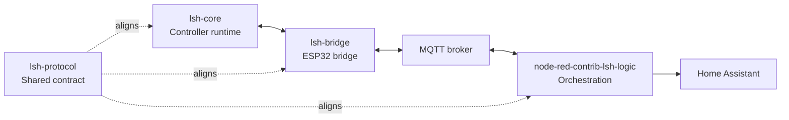
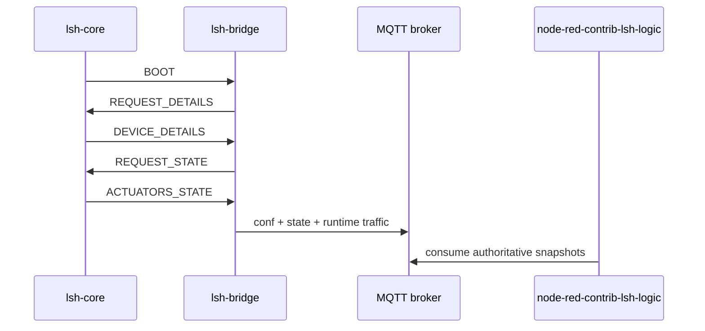
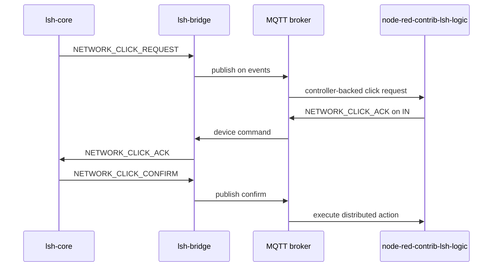

# LSH Reference Stack

This document defines the current **public reference stack** for Labo Smart Home.

The base LSH protocol is intentionally transport-agnostic and role-oriented. The
public stack documented here is the concrete profile implemented by the current
repositories and used by the live installation.

Use this page when you want one coherent, cross-repo explanation before diving
into repository-specific details.

If some terms are still unclear while reading, keep
[GLOSSARY.md](./GLOSSARY.md) nearby. If you are still deciding whether the
stack fits your use case, skim [FAQ.md](./FAQ.md). If you are already in bring-up
mode and something looks wrong, keep
[TROUBLESHOOTING.md](./TROUBLESHOOTING.md) nearby too.

## Public Repositories

| Repository                                                                           | Role in the reference stack                                                             |
| ------------------------------------------------------------------------------------ | --------------------------------------------------------------------------------------- |
| [`lsh-core`](https://github.com/labodj/lsh-core)                                     | Authoritative controller runtime for field I/O, local logic and compact serial payloads |
| [`lsh-bridge`](https://github.com/labodj/lsh-bridge)                                 | ESP32 bridge between serial LSH, MQTT and Homie                                         |
| [`node-red-contrib-lsh-logic`](https://github.com/labodj/node-red-contrib-lsh-logic) | Central orchestration peer on MQTT                                                      |
| [`lsh-protocol`](https://github.com/labodj/lsh-protocol)                             | Shared source of truth for command IDs, compact keys and generated artifacts            |

## Runtime Shape

```text
+------------------+     +------------------+     +-------------+     +---------------------------+     +----------------+
| lsh-core         |<--->| lsh-bridge       |<--->| MQTT broker |<--->| node-red-contrib-lsh-logic|---->| Home Assistant |
| Controllino side |     | ESP32 bridge     |     | transport   |     | orchestration             |     | UI / entities  |
+------------------+     +------------------+     +-------------+     +---------------------------+     +----------------+
```

The runtime path has three active peers. `lsh-protocol` sits beside them as the
shared contract that keeps payload IDs, keys and generated code aligned.



## Responsibilities

- `lsh-core` owns physical inputs, relays, indicators, local click behavior and
  the authoritative device topology/state emitted on the serial link.
- `lsh-bridge` owns serial framing, controller synchronization, MQTT transport,
  Homie projection and bridge-local diagnostics.
- `node-red-contrib-lsh-logic` owns central registry state, startup recovery,
  watchdog logic and distributed click orchestration across devices.
- `lsh-protocol` owns the wire-level contract, not the runtime policy of any
  specific implementation.

## MQTT Profile

The current public MQTT profile uses these topic families:

- `LSH/<device>/conf`: authoritative device topology snapshot derived from
  `DEVICE_DETAILS`
- `LSH/<device>/state`: authoritative actuator state snapshot derived from
  `ACTUATORS_STATE`
- `LSH/<device>/events`: controller-backed runtime traffic such as
  `NETWORK_CLICK_*` payloads and device-level `PING` replies
- `LSH/<device>/bridge`: bridge-local runtime traffic such as service-level
  ping replies and diagnostics
- `LSH/<device>/IN`: inbound device command topic consumed by `lsh-bridge`
- `LSH/Node-RED/SRV`: bridge-scoped service topic used for public orchestration
  and recovery commands

That split is intentional: consumers must not treat bridge-local traffic as if
it were proof that the downstream controller is currently alive.

## Bootstrap And Resync

The reference stack uses a strict controller-authoritative resync model:

1. `lsh-core` finishes configuration and emits `BOOT`.
2. `lsh-bridge` treats that `BOOT` as an instruction to stop trusting any
   runtime assumptions derived from the controller.
3. The bridge asks for fresh `DEVICE_DETAILS`.
4. After details are validated, the bridge asks for fresh `ACTUATORS_STATE`.
5. The bridge becomes fully synchronized only after both phases complete.



Important bridge-side behavior:

- if validated topology is already cached and still matches, the bridge keeps
  running and only waits for fresh authoritative state
- if no validated topology is cached yet, or if topology changed, the bridge
  persists the new details and performs one controlled reboot so MQTT topics and
  Homie nodes are rebuilt from a coherent snapshot
- MQTT reconnects do not redefine the protocol. The bridge re-subscribes and
  re-establishes runtime sync around the cached or freshly confirmed controller
  model

Important Node-RED behavior:

- at startup, `node-red-contrib-lsh-logic` reuses retained `conf` and `state`
  only as the last known authoritative snapshots
- retained snapshots are not proof of current reachability
- if one or more configured devices are still missing authoritative snapshots,
  Node-RED sends one bridge-local `BOOT` on the service topic to request a
  replay, then repairs missing snapshots and pings devices that are still
  unreachable

## `PING` And `BOOT` Semantics

The base protocol keeps both commands local to the current hop or role unless a
profile documents a stronger meaning. In the current public profile:

- serial `PING` is hop-local between `lsh-core` and `lsh-bridge`
- device-topic `PING` is answered on `events` only when the bridge currently has
  a live and synchronized controller path
- service-topic `PING` is answered on `bridge` and reports bridge-local runtime
  health such as `controller_connected`, `runtime_synchronized` and
  `bootstrap_phase`
- controller `BOOT` invalidates bridge-side trust in cached controller state
- service-topic `BOOT` is a bridge-local resync trigger; it does not redefine
  `BOOT` as a mandatory end-to-end traversal command

For the role-oriented explanation behind these rules, read
[`lsh-protocol/docs/profiles-and-roles.md`](https://github.com/labodj/lsh-protocol/blob/main/docs/profiles-and-roles.md).

## Network Click Flow

The public stack implements a two-phase network click handshake:

1. `lsh-core` emits `NETWORK_CLICK_REQUEST` on serial after a configured network
   click starts.
2. `lsh-bridge` republishes that request on `LSH/<device>/events`.
3. `node-red-contrib-lsh-logic` validates the request, checks the involved
   devices and sends `NETWORK_CLICK_ACK` on `LSH/<device>/IN`.
4. `lsh-bridge` forwards the ACK to `lsh-core`.
5. `lsh-core` confirms the click with `NETWORK_CLICK_CONFIRM`.
6. Node-RED executes the distributed automation only after that confirmation.

If the handshake stalls, `lsh-core` falls back according to the configured local
policy for that clickable.



## Where To Find Specific Answers

When you need one exact answer fast, this is the shortest map:

- **Terminology**: [GLOSSARY.md](./GLOSSARY.md)
- **Adoption and evaluation questions**: [FAQ.md](./FAQ.md)
- **Bring-up failures and symptom-based diagnosis**: [TROUBLESHOOTING.md](./TROUBLESHOOTING.md)
- **System-level hardware pattern**: [HARDWARE_OVERVIEW.md](./HARDWARE_OVERVIEW.md)
- **Controller feature flags and firmware integration**: [`lsh-core` README](https://github.com/labodj/lsh-core)
- **Bridge runtime policy and diagnostics**: [`lsh-bridge/docs/runtime-behavior.md`](https://github.com/labodj/lsh-bridge/blob/main/docs/runtime-behavior.md)
- **Bridge compile-time knobs**: [`lsh-bridge/docs/compile-time-configuration.md`](https://github.com/labodj/lsh-bridge/blob/main/docs/compile-time-configuration.md)
- **Node-RED setup, `system-config.json` and examples**: [`node-red-contrib-lsh-logic` README](https://github.com/labodj/node-red-contrib-lsh-logic) and [`examples/`](https://github.com/labodj/node-red-contrib-lsh-logic/tree/main/examples)
- **Canonical wire contract**: [`lsh-protocol/shared/lsh_protocol.md`](https://github.com/labodj/lsh-protocol/blob/main/shared/lsh_protocol.md)
- **Role semantics for `BOOT`, `PING`, profiles and immediate peers**: [`lsh-protocol/docs/profiles-and-roles.md`](https://github.com/labodj/lsh-protocol/blob/main/docs/profiles-and-roles.md)

## Reading Order

If you are new to the project, this is the shortest practical path:

1. Read the landing [README](./README.md) for scope and project history.
2. Skim [GLOSSARY.md](./GLOSSARY.md) for the core terms.
3. Skim [FAQ.md](./FAQ.md) for the shortest decision-oriented answers.
4. Read this page for the public reference profile.
5. Read [GETTING_STARTED.md](./GETTING_STARTED.md) if you plan to wire a real first lab.
6. Keep [TROUBLESHOOTING.md](./TROUBLESHOOTING.md) nearby once you start testing real traffic.
7. Read [`lsh-core`](https://github.com/labodj/lsh-core) for controller-side runtime behavior.
8. Read [`lsh-bridge`](https://github.com/labodj/lsh-bridge) for bridge/runtime policy.
9. Read [`node-red-contrib-lsh-logic`](https://github.com/labodj/node-red-contrib-lsh-logic) for orchestration behavior.
10. Read [`lsh-protocol`](https://github.com/labodj/lsh-protocol) for the exact shared contract.
